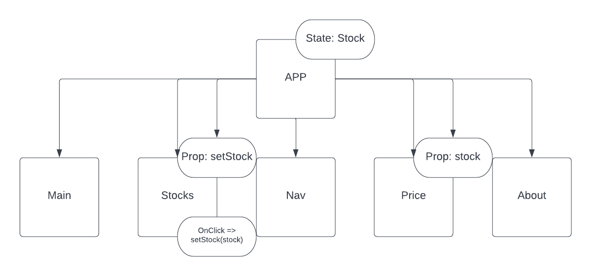

# Stock-Market
A project that shows the functionality of react-router-dom. This allows our Single Page Application (SPA) to behave if there were multiple pages. 

## React component structure


## Technologies Used
### Languages
- JavaScript, HTML, CSS
### Frameworks & more
- Node.js
- Express
- React
- styled-components (Will come in a future update!)

## Getting started
### Installation:
To download this repository and start the server:
```
$ git clone https://github.com/SunghunP/Stock-Market
$ cd ../path/to/the/file
$ npm install
$ npm start
```

### Contributing:
1. Fork it!
2. Create your own branch: `git checkout -b my-new-branch`
3. Commit your changes: `git commit -am 'Add some feature'`
4. Push to the branch: `git push origin my-new-branch`
5. Submit a pull request! 

## Getting Started with Create React App
This project was bootstrapped with [Create React App](https://github.com/facebook/create-react-app).

## Available Scripts

In the project directory, you can run:
### `npm start`
### `npm test`
### `npm run build`
### `npm run eject`

**Note: this is a one-way operation. Once you `eject`, you can't go back!**

## Updates
- I want to style this project using styled components. This will allow my file structure to stay the same and the CSS code will stay inside the component files. 